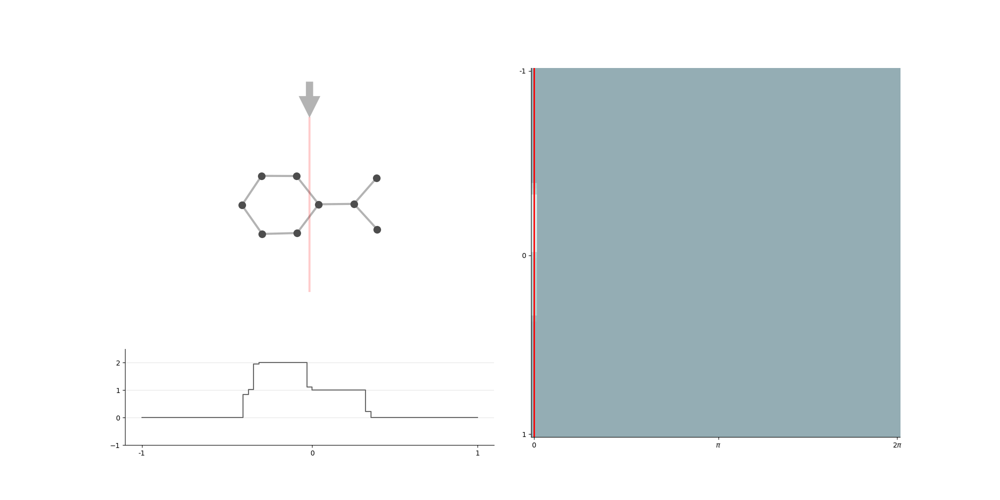

# DECT - Differentiable Euler Characteristic Transform
[](https://arxiv.org/abs/2310.07630)  

This is the official repository for the ICLR 2024 paper: [Differentiable Euler Characteristic Transforms for Shape Classification](https://arxiv.org/abs/2310.07630).

**Abstract** The Euler Characteristic Transform (ECT) has proven to be a powerful representation, combining geometrical and topological characteristics of shapes and graphs. However, the ECT was hitherto unable to learn task-specific representations. We overcome this issue and develop a novel computational layer that enables learning the ECT in an end-to-end fashion. Our method, the Differentiable Euler Characteristic Transform (DECT), is fast and computationally efficient, while exhibiting performance on a par with more complex models in both graph and point cloud classification tasks. Moreover, we show that this seemingly simple statistic provides the same topological expressivity as more complex topological deep learning layers.




Please use the following citation for our work:

```bibtex
@inproceedings{Roell24a,
  title         = {Differentiable Euler Characteristic Transforms for Shape Classification},
  author        = {Ernst R{\"o}ell and Bastian Rieck},
  year          = 2024,
  url           = {https://openreview.net/forum?id=MO632iPq3I},
}
```

## Installation
Our code has been developed using python 3.10 and using pytorch 2.0.1 installed 
with CUDA 11.7. 
After installing the above, install the requirements in the requirements.txt.

```{python}
pip install torch torchvision torchaudio --index-url https://download.pytorch.org/whl/cu117
pip install -r requirements.txt
```

## Usage

To run a single experiment, run `single_main.py` and modify the path to the 
right experiment. 
The configuration files for each experiment can be found under the 
`experiment` folder and the parameters are in the `.yaml` files.

To run all experiments in a folder, update the path in `main.py` to that 
folder and run `main.py`.

All datasets will be downloaded and preprocessed when first ran via the 
`torch_geometric` package. 
The TU Datasets are small and run fast, so for testing purposes it is recommended
to run these first.

## Examples 

The core of our method, the differentiable computation of the Euler Characteristic 
transform, can be found in the `./models/layers/layers.py` folder.
Since the code is somewhat terse, highly vectorised and optimized for batch 
processing, we provide an example computation that illustrates the core 
principle of our method. 


## License

Our code is released under a BSD-3-Clause license. This license
essentially permits you to freely use our code as desired, integrate it
into your projects, and much more --- provided you acknowledge the
original authors. Please refer to [LICENSE.md](./LICENSE.md) for more
information. 

## Issues

This project is maintained by members of the [AIDOS Lab](https://github.com/aidos-lab).
Please open an [issue](https://github.com/aidos-lab/TARDIS/issues) in
case you encounter any problems.
